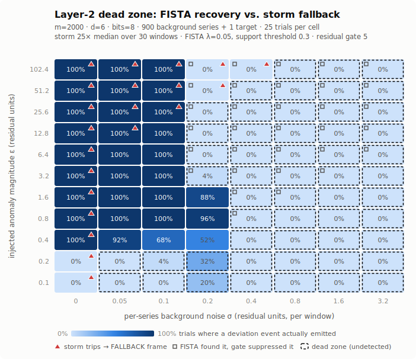

# The Layer-2 dead zone (measured)

ADR-004's storm fallback and ADR-002's sparse recovery each protect one end
of the anomaly spectrum, and there is a gap between them. The storm
detector watches *global* pre-quantization sketch energy — an Availability
Zone dying trips it easily, but a single low-volume payment service going
from 0.01% to 0.5% errors moves `‖y‖²/m` by essentially nothing. That
anomaly's only remaining path to an alert is FISTA recovery, where it must
survive L1 shrinkage, the post-solve support threshold, RESIDUAL
quantization, dilution by every other series' background jitter, and
palimpsestd's max-residual gate. Anomalies small enough to fail all of that
but too small to trip the breaker are in a **dead zone**: Layer 2 emits
nothing for them, in any window.

This document records where that zone actually is, measured end-to-end at
production defaults with `plsim --deadzone` (see
[Reproducing](#reproducing-and-re-measuring)). It is a *known, bounded
limitation*, in the same spirit as README's Limitations section — the
alternative is someone finding it during an incident.



## Units, and what "small" means here

Everything is in **absolute residual units**: the difference between a
series' reported value and its open-loop Hold baseline (ADR-003) in one
flush window. A payment service handling 20 req/s flushed every 10s
reports ~200 requests per window; its error-count series going from 0.01%
to 0.5% is a residual of ε ≈ **1.0**. The same anomaly expressed as an
error-*ratio* series is a residual of ε ≈ **0.005**.

Background noise σ is the per-series, per-window jitter every *other*
series carries around its own baseline (Gaussian, redrawn each window —
the uncorrelated-with-the-predictor jitter that `cmd/plsim/main.go`'s
`--noise` comment warns about).

## The measured boundary

Defaults: m=2000, d=6, bits=8, 900 background series + 1 target, 25
trials/cell, seed 1. Storm: 25× rolling median over 30 windows, FALLBACK
top-K 100 (otel/processor/csresidual defaults). Recovery: FISTA iters=350,
λ=0.05, support threshold 0.3, deviation events gated above solve residual
5.0 (palimpsestd defaults).

| noise σ | recovery floor (≥90%) | detection floor (≥90%) | storm fires from (≥50%) | undetected up to (<50%) |
| --- | --- | --- | --- | --- |
| 0 | 0.4 | 0.1 | 0.1 | — |
| 0.05 | 0.4 | 0.4 | 12.8 | 0.2 |
| 0.1 | 0.8 | 0.8 | 25.6 | 0.2 |
| 0.2 | — | 51.2 | 51.2 | 25.6 |
| 0.4 | — | 102.4 | 102.4 | 51.2 |
| 0.8 | — | — | — | 102.4 |
| 1.6 | — | — | — | 102.4 |
| 3.2 | — | — | — | 102.4 |

- **recovery floor**: smallest ε whose deviation event reliably emits
  (target in the FISTA support *and* solve residual under the gate), there
  and at every larger tested ε.
- **detection floor**: same, but a FALLBACK heavy-hitter hit counts when
  the storm breaker trips.
- **undetected up to**: largest ε missed by both paths in >50% of trials —
  the dead zone's top edge. (At σ=0.2 the zone is non-contiguous; see
  mechanism 3.)

Four mechanisms draw this map:

1. **An absolute floor at ε ≈ 0.4.** The post-FISTA support cutoff is 0.3
   in residual units (`palimpsestd --fista-threshold`); below it a
   candidate is never reported no matter how quiet the fleet. An
   error-*ratio* series' 0.005 residual is permanently invisible to
   substrate (a) — by two orders of magnitude. Count-shaped series clear
   this floor; ratio-shaped ones structurally don't.

2. **The floor rises with noise.** At σ=0.05 the floor is 0.4; at σ=0.1
   it's 0.8 (ε=0.4 recovers only 68% of trials). The solver's raw floor
   (ignoring the gate) tracks roughly ε ≳ 4σ in this configuration — small
   signals smear into the same buckets the noise occupies.

3. **The max-residual gate closes — from the top down first.** The
   unexplained solve residual grows with fleet noise (measured ≈ 4.5 at
   σ=0.2, ≈ 6 at σ=0.4, ≈ 12 at σ=0.8 with n=900, m=2000), and
   palimpsestd suppresses *all* deviation events above 5.0. At σ=0.2 this
   produces a band-pass: ε of 0.8–1.6 emits (96%/88%) while ε ≥ 3.2 is
   **suppressed** (4% → 0%). The cause is λ-coupling, not quantization:
   `Options.Lambda` scales with `max|Φᵀy|` (ADR-014 conformance), so a
   large anomaly raises every series' L1 penalty, the solver stops
   absorbing background noise into spurious support (measured: 66 spurious
   entries at ε=0.8 falling to ~0 at ε=12.8), and the un-absorbed noise
   pushes the residual over the gate. Re-running the sweep at `--bits 16`
   confirms it: the donut is unchanged. From σ ≈ 0.3 the baseline residual
   alone exceeds the gate and the entire column stops emitting — the
   solver still *finds* ε ≥ 1.6 in ≥96% of trials (the CSV's
   `support_rate`), but nothing reaches an operator.

4. **The storm bar is ~147σ away.** The breaker needs
   `‖y‖²/m > 25 × median`, i.e. a single anomaly of
   ε ≳ σ·√(24·n) ≈ 147σ at n=900. Measured: fires from ε=12.8 at σ=0.05,
   25.6 at σ=0.1, 51.2 at σ=0.2, 102.4 at σ=0.4, and never below that in
   noisier columns (the anomaly window reaches only ~4% of the trigger bar
   — the CSV's `storm_headroom`). The σ=0 column is a degenerate
   hair-trigger: a perfectly silent fleet has median energy 0, so *any*
   anomaly trips the breaker and rides out in the FALLBACK top-K. Real
   fleets are never silent.

Worked example: the payment service's ε ≈ 1.0 error-count anomaly is
recovered reliably at σ ≤ 0.1, sits at ~90% at σ=0.2, and is **silent at
σ ≥ 0.4** — while the storm breaker would need it to be two orders of
magnitude larger to notice. As a ratio series it is silent everywhere.

## Knobs, and their honest trade-offs

- **`--fista-threshold` ↓** lowers the absolute floor and admits more
  spurious support. It cannot help below the noise smear (mechanism 2).
- **`--max-residual` ↑** re-opens the gate: recall of ε ≥ 1.6 at σ=0.4
  returns to ~96-100% (the `support_rate` column is exactly the
  gate-disabled recovery rate). The price is precision: those solves carry
  ~200 spurious support entries (the M/10 cap, saturated) per window — 1
  real anomaly in 200 reported. This is the recall-side quantification of
  the precision collapse already noted on plsim's `--noise` flag. The gate
  is doing its job; raising it converts silence into noise, not into
  signal.
- **`--bits 16`** does not move the boundary (measured); the lossy step
  that matters is the solve itself, not RESIDUAL quantization.
- **Storm `energy_multiplier` ↓** lowers the bar for *global* events but
  cannot help here: a FALLBACK frame carries only the top-K
  heavy-hitters, and a small series doesn't rank. (Corollary: during a
  *genuine* storm, RESIDUAL frames are replaced by FALLBACK entirely, so a
  concurrent small anomaly is shadowed no matter where it falls on this
  map.)
- **m ↑** (wider sketch) genuinely shrinks the zone — less noise folds
  into each bucket and the residual gate closes later. Re-run the sweep at
  your own m/n to re-draw the map.
- **Reducing σ itself** is the real lever: per-series residual jitter this
  large usually means the Hold baseline is stale relative to genuine
  window-to-window variance — more instances folded per logical series
  (ADR-008), longer flush windows, or a better predictor all lower σ
  directly.

What still sees a dead-zone anomaly: Layer 1's exact keyframes record it
forever (queryable after the fact, but alert-free: substrate (c)'s drift
threshold defaults to 10.0), and substrate (b)'s PointQuery can read it
on demand if something else tells you which series to ask about. Alerting
on sub-residual-unit anomalies needs the exact tier (ADR-005) — that is
the documented boundary, not an oversight.

## Reproducing and re-measuring

```sh
go run ./cmd/plsim --deadzone --deadzone-out ./deadzone
```

writes `deadzone.csv` (full grid: storm/support/gate/recovery/detection
rates, value error, solve residual, spurious support, storm headroom),
`deadzone.svg` (the map above) and `deadzone-summary.md` (the boundary
table) in ~10s. Runs are deterministic in `--seed`. Every production knob
is a flag defaulting to where that knob really lives (`--deadzone-storm-*`,
`--deadzone-fista-*`, `--deadzone-max-residual`), so a deployment can
re-hunt the boundary under its own configuration, e.g.:

```sh
go run ./cmd/plsim --deadzone --m 4000 --deadzone-background 2000 \
  --deadzone-noises 0.1,0.2,0.4 --deadzone-magnitudes 0.5,1,2,4,8 \
  --deadzone-max-residual 10
```

`cmd/plsim/deadzone_test.go` pins the zone's existence (a quiet-fleet
anomaly recovers; a noise-drowned one is missed with the breaker silent),
so a recovery-stack change that moves this boundary shows up in `go test`.

## Scope

The sweep injects residuals directly into the accumulator — the
Tracker/Hold layer is bypassed (for this question the predictor is an
identity: whatever survives prediction *is* the residual, and the sweep
parameterizes it). ADR-003's keyframe-reversal caveat is therefore
separate, as is the *density* failure mode (many series deviating at once
— ADR-004's m/5 cliff), which the storm breaker does catch. Noise is
i.i.d. Gaussian per series per window; correlated noise (a deploy wave)
behaves more like the density regime. The map is for one anomaly at a
time — the honest worst case for the smallest signal, not for busy
incidents.
