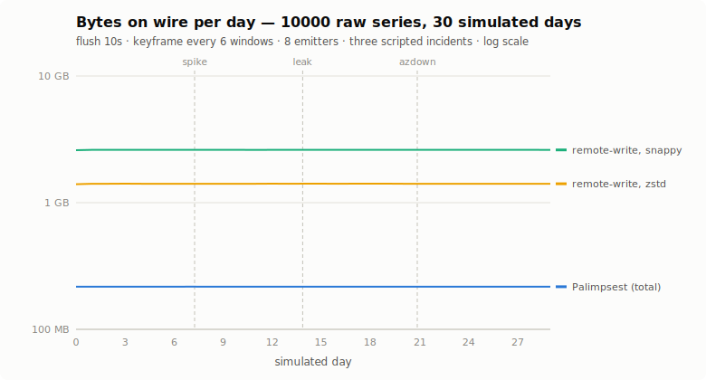

# The 30-day byte ledger (M2 benchmark, measured)

The cost table in [COSTS.md](COSTS.md) is a model. This page is a
measurement: a simulated month of Kubernetes-shaped telemetry pushed
through the real encode pipeline, with three scripted incidents that fire
every exact-data escape hatch, against a byte-exact raw remote-write
baseline. Run it yourself with `plsim --month` (~11 minutes,
deterministic in `--seed`; this page is seed 1 with `--codec zstd`).

The world: 10,000 raw per-instance series — 2,000 logical groups × 5 pods,
folded per ADR-008 into 6,000 sketched logical series — with daily
seasonality, 0.2% per-instance read noise, 7 pod replacements/min (which
never touch the sketch) and 2 logical group replacements/min (which do,
via dict deltas and golden keyframes), across 8 emitters at a 10s flush.



## The number

| line | GiB/month | vs Palimpsest |
| --- | --- | --- |
| raw remote-write, uncompressed | 388.3 | 64.0× |
| raw remote-write, snappy (what RW 1.0 actually ships) | 73.0 | **12.0×** |
| raw remote-write, zstd (a generous baseline no stock Prometheus ships) | 39.4 | 6.5× |
| **Palimpsest, everything included** | **6.06** | 1× |

Both sides are byte-exact: every Palimpsest frame is measured with
`wire.EncodedSize` (keyframes, KDELTA, RESIDUAL sketches, FALLBACK frames,
dashcam snapshot blobs, dict deltas); the baseline is the same fleet as
per-instance prompb `WriteRequest`s — labels repeated every window, as
remote-write 1.0 really behaves — compressed with a real snappy encoder
and, for the generous variant, zstd.

Where Palimpsest's 6.06 GiB goes: **55.2%** RESIDUAL sketches (a fixed
~2.1KB × 8 emitters × 8,640 windows/day, independent of fleet size),
**38.8%** golden keyframes (the price of logical churn — consistent with
ADR-017's measurement that full-dict re-announcement dominates wire cost
at realistic churn), **6.0%** KDELTA keyframes, and **≈0.00%** for the
FALLBACK frames and dashcam snapshots the incidents fired (87 KB and 56 KB
respectively, over the whole month).

**Incident days cost nothing extra.** Day 21 — the AZ collapse, breaker
firing, snapshots attached — totaled 217.07 MB; quiet day 22 totaled
217.09 MB. A FALLBACK frame is *smaller* than the RESIDUAL it replaces,
so the worst day of the month was marginally cheaper than a normal one.
There is no "incident tax" on this wire; the fear that escape hatches
blow up the compression ratio is measured at ≈0.006% of one day's bytes.
(The tax that does exist is fidelity, not bytes — see below and
[ENVELOPE.md](ENVELOPE.md).)

## What the three incidents measured

| | spike (+50 on 5 series, 15 min) | leak (+20 ramp over 6 h, 1 series) | azdown (+100 on 30% of fleet, 30 min) |
| --- | --- | --- | --- |
| FISTA support (substrate a) | hit at **0s**, 31% of solve windows | flukes only (8% — indistinguishable from fleet jitter) | never (storm windows carry no RESIDUAL) |
| Deviation event emitted | **never** — solve residual ≈20 vs default gate 5 | never | never |
| Keyframe drift (substrate c) | **30s** (Δ 50.6 vs threshold 10) | **6h 0m 30s** — the end-of-ramp collapse, i.e. the OOM kill, not the cause | **30s** (Δ 101.1) |
| Storm fallback | not fired | not fired | 24 fallback windows, all in the **first ~30s**; top-K coverage 97% |
| Dashcam lookback vs cause | covers 100% of span | covers **4.2%** of the climb | covers 50% of span |

Four things this run established, beyond re-confirming the
[DEADZONE.md](DEADZONE.md) boundaries at scale:

1. **At 10k-series scale, substrate (a) never emitted anything all
   month.** Quiet-window solve residual averaged 19.97 against
   palimpsestd's default `--max-residual` 5.0 — 100% of solves gated, with
   ~194 support entries of fleet jitter each. This is the dead-zone map's
   σ≈0.3-column prediction, now measured end-to-end: at this fleet size
   and noise, detection lives in substrate (c) and the storm path, not in
   FISTA deviation events, unless the gate is retuned for the fleet.
2. **The fallback burst is keyframe-bounded.** The 30-minute outage
   produced fallback frames only for its first ~30s: the next keyframe
   re-based the +100 shift into every affected baseline (ADR-003) and
   RESIDUAL frames resumed. The breaker is an onset detector, not an
   outage-duration detector — and the exact top-K detail you get from it
   exists only in that first minute (plus the recovery transient when the
   outage ends).
3. **Per-emitter sharding is what kept top-K coverage at 97%.** 600
   affected series ÷ 8 emitters ≈ 75 per FALLBACK frame, under the
   top-100 cut. One emitter carrying all 600 would have covered 17%.
4. **The leak was detected only when it died.** Nothing fired during six
   hours of climb (per-window residual ~0.06, keyframe drift ~0.56 — both
   deep in the dead zone); substrate (c) flagged the Δ20 collapse at the
   ramp's end. At that moment the 15-minute dashcam lookback covered the
   final 4.2% of the climb — the T-45 problem ([ENVELOPE.md](ENVELOPE.md)
   §6-8) with concrete numbers: T-360 minutes of cause, 15 minutes of
   evidence.

## Scaling honesty

The sketch is a fixed per-emitter, per-window cost, so the ratio *grows*
with fleet size and shrinks below it: the same benchmark at 1,000 raw
series measures only 3.7× vs snappy (2.0× vs zstd) — most of the wire is
then the fixed sketch. At 10k series it is 12.0×; wider fleets amortize
further. Conversely, golden keyframes scale with logical churn and label
sizes (ADR-017), so a churnier or longer-labeled fleet pays more there.
Re-run with your own shape:

```sh
go run ./cmd/plsim --month --codec zstd --month-out ./month \
  --month-series 10000 --month-logical-churn 2 --month-noise 0.2
```

Outputs: `month.csv` (per-day bytes by frame class), `month.svg` (the
chart above), `month-summary.md` (totals, incident table, accounting
notes). `cmd/plsim/month_test.go` pins the structural claims (all frame
classes present, baseline ordering, breaker fires for the mass incident,
leak invisible to breaker and drift, spike found by the solver).

## What this ledger does not claim

- It is wire bytes, not a bill. The per-series-billing arbitrage — the
  30-100× line — is [COSTS.md](COSTS.md)'s territory and depends on what
  fraction of series your alerts promote to the expensive tier.
- Dashcam snapshot bytes here are per logical series; the otel processor
  buffers per instance, so real snapshot bytes multiply by flagged-series
  instance counts (still bounded by the ENVELOPE §6-8 caps).
- The baseline has no batching/staleness tricks, and the zstd variant is
  deliberately generous. Nothing here models Remote-Write 2.0's interned
  label sets; against that future baseline the wire gap narrows and the
  per-series-billing argument carries more of the weight.
- Single shard, single view, no epoch rotation, no Kafka framing overhead
  on either side.
